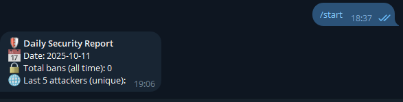
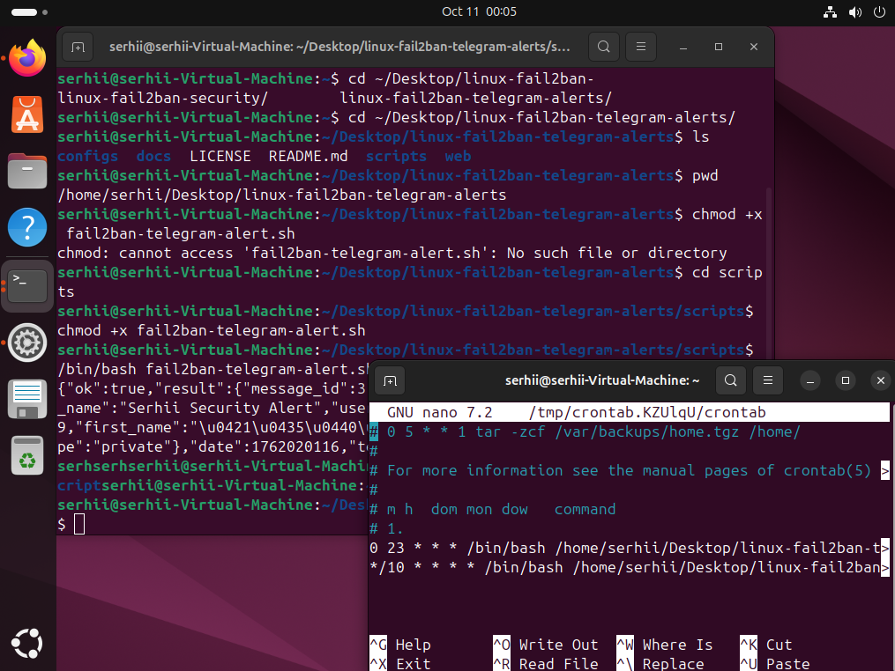

# 🔐 Secure Linux Server with Fail2ban + Telegram Alerts

This project provides a **complete automation system for securing a Linux server** using **Fail2ban** and **Telegram integration**.
It blocks brute-force attacks, sends daily reports to Telegram, and generates a web-based status dashboard.

Designed for **Ubuntu 24.04 LTS** — ideal for **Junior SysAdmin**, **DevOps**, or **SOC Analyst** skill development.

---

## ⚙️ Overview

**Key Capabilities:**
- 🚫 Auto-blocks brute-force SSH attacks with Fail2ban
- 📩 Sends **daily security summaries** via Telegram Bot
- 🌐 Hosts a **static HTML dashboard** showing total bans and recent activity
- 🔁 Fully automated through **cron jobs**

---

| **Live Telegram Alert** | **Terminal (Setup & Automation)** |
| :---: | :---: |
|  |  |

---

## ✅ Features

- **Custom SSH Jail:** Hardened configuration for non-default SSH ports
- **Daily Telegram Report:** Includes ban count and top attacking IPs
- **HTML Dashboard:** Simple static status page with total bans
- **Non-Destructive Setup:** Safe scripts that preserve existing Fail2ban rules
- **Lightweight Automation:** Requires minimal resources and no external dependencies

---

## 🛠️ Prerequisites

- 🧩 Ubuntu 24.04 LTS (local VM or cloud instance, e.g., AWS EC2)
- 🔒 Installed: `fail2ban`, `curl`, `cron`
- 💬 Telegram account (for bot alerts)

---

## 🚀 Setup Instructions

### 1️⃣ Clone the repository
```bash
git clone https://github.com/gorinserhii-spec/linux-fail2ban-telegram-alerts.git
cd linux-fail2ban-telegram-alerts
```

### 2️⃣ Configure Telegram Alert Script

File: scripts/fail2ban-telegram-alert.sh

```bash
#!/bin/bash
# fail2ban-telegram-alert.sh
# Sends a daily summary of Fail2ban bans to Telegram

BOT_TOKEN="YOUR_BOT_TOKEN_HERE"      # ← Replace with your Telegram Bot token
CHAT_ID="YOUR_CHAT_ID_HERE"          # ← Replace with your Telegram Chat ID

LOG_FILE="/var/log/fail2ban.log"
DATE=$(date '+%Y-%m-%d')
BAN_COUNT=$(grep -c "Ban " $LOG_FILE)
BANNED_IPS=$(grep "Ban " $LOG_FILE | awk '{print $NF}' | sort | uniq -c | sort -nr | head -5)

MESSAGE="🛡️ *Daily Security Report*  
📅 Date: $DATE  
🔒 Total banned IPs: $BAN_COUNT  
🌐 Top attackers:  
$(printf ' - %s\n' $BANNED_IPS)"

# Send to Telegram
curl -s -X POST "https://api.telegram.org/bot$BOT_TOKEN/sendMessage" \
  -d chat_id="$CHAT_ID" \
  -d text="$MESSAGE" \
  -d parse_mode="Markdown"
```

### 3️⃣ Automate Daily Execution

Add the following line to your crontab:
```bash
sudo crontab -e
```

Then append:
```bash
0 7 * * * /path/to/scripts/fail2ban-telegram-alert.sh
```

This will send the report every day at 07:00.

### 🧠 Summary
This project demonstrates professional Linux hardening and security automation practices:

- Efficient Bash scripting
- System monitoring and reporting
- Telegram API integration
- Fail2ban configuration management
- Cron-based automation

## 📜 License
This project is licensed under the [MIT License](./LICENSE).

=================================================
# Author: Serhii Gorin 
# Date: 11.10.2025
